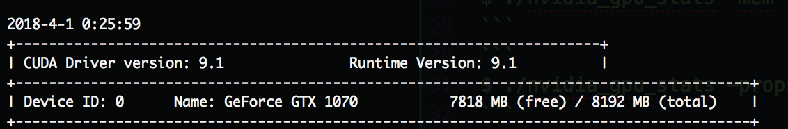
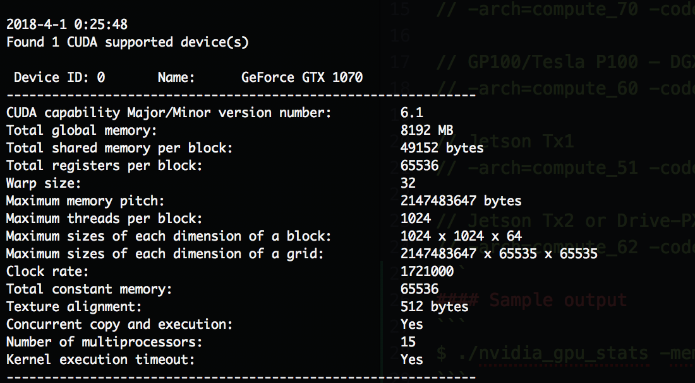

# nvidia-gpu-stats
Simple CUDA script to check the usage of NVIDIA GPU.
- Query used & available memory of the CUDA supported devices (especially useful for MAC users without nvidia-smi support)
- Query the CUDA supported device properties (like Global memory, Clock speed, Warp size etc.,)

```
# Choose the appropriate arch according to your GPU device (scroll below to see other options)
$ nvcc -arch=compute_61 -code=sm_61 nvidia_gpu_stats.cu -o nvidia_gpu_stats
$ ./nvidia_gpu_stats -mem
```

#### Sample output
```
$ ./nvidia_gpu_stats -mem
```


```
$ ./nvidia_gpu_stats -props
```


Choose the appropriate arch according to your GPU
```
// GTX 1080, GTX 1070, GTX 1060, GTX 1050, GTX 1030, Titan Xp, Tesla P40, Tesla P4
// -arch=compute_61 -code=sm_61

// Tesla V100
// -arch=compute_70 -code=[sm_70,compute_70]

// GP100/Tesla P100 – DGX-1
// -arch=compute_60 -code=sm_60

// Jetson Tx1
// -arch=compute_51 -code=[sm_51,compute_51]

// Jetson Tx2 or Drive-PX2
// -arch=compute_62 -code=[sm_62,compute_62]
```
